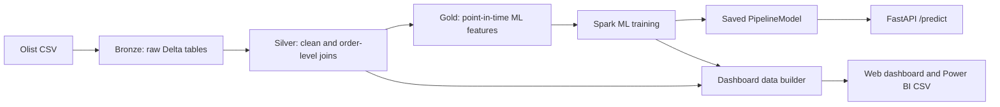

# E-commerce Big Data Analytics

Project phan tich va du doan customer satisfaction tren bo du lieu Olist Brazilian
E-commerce. Pipeline su dung PySpark va Delta Lake, model duoc deploy bang FastAPI,
dashboard web hien thi KPI thuc te va CSV co the nap vao Power BI.

## Ket Qua Hien Tai

| Thanh phan | Trang thai |
|---|---|
| Data understanding | Hoan thanh |
| Bronze / Silver ETL | Hoan thanh, mot dong cho moi `order_id` |
| Feature engineering | Hoan thanh, da loai data leakage |
| Machine learning | Da train lai voi chronological split |
| FastAPI | Co `GET /health`, `POST /predict`, Swagger UI |
| Dashboard | Co dashboard web va CSV cho Power BI |
| ERD | Co Mermaid ERD |

Model dang deploy la Random Forest. Sau khi loai leakage, ket qua tren `19,976`
order moi nhat:

| Metric | Gia tri |
|---|---:|
| Accuracy | 84.20% |
| Balanced accuracy | 58.96% |
| F1 score | 91.08% |
| ROC-AUC | 67.02% |
| PR-AUC | 87.93% |

Chi tiet nam trong
[best_model_metrics.json](ecomerce-api/models/best_model_metrics.json).

## Kien Truc



ERD chi tiet: [architecture/erd.md](architecture/erd.md).

## Cau Truc Thu Muc

```text
project/
|-- architecture/
|   `-- erd.md
|-- dashboards/
|   |-- data/dashboard_data.json
|   |-- powerbi/*.csv
|   |-- index.html
|   |-- app.js
|   `-- styles.css
|-- ecomerce/
|   |-- 01_data_understanding.ipynb
|   |-- 02_etl_pipeline.ipynb
|   |-- 03_feature_engineering.ipynb
|   |-- 04_machine_learning.ipynb
|   |-- build_dashboard_data.py
|   `-- train_local.py
|-- ecomerce-api/
|   |-- app/
|   |-- models/best_model/
|   |-- Dockerfile
|   `-- requirements.txt
`-- detailed_ecommerce_bigdata_project_roadmap_md.md
```

## Chay API Bang Docker

Docker la runtime duoc khuyen nghi. Image da cai OpenJDK 17 LTS va pin
`pyspark==4.1.1` de khop voi model.

```powershell
cd ecomerce-api
docker build -t ecommerce-prediction-api .
docker run --rm -p 8000:8000 ecommerce-prediction-api
```

Swagger UI: [http://127.0.0.1:8000/docs](http://127.0.0.1:8000/docs)
Health check: [http://127.0.0.1:8000/health](http://127.0.0.1:8000/health)

Test prediction:

```powershell
$body = @{
  payment_type = "credit_card"
  payment_installments = 1
  number_of_items = 1
  avg_item_price = 100.0
  delivery_time = 7
  delivery_delay = -2
  shipping_duration = 1
  order_total_value = 110.0
  customer_total_orders = 0
  customer_total_spent = 0.0
  avg_review_score_customer = 0.0
} | ConvertTo-Json

Invoke-RestMethod `
  -Uri http://127.0.0.1:8000/predict `
  -Method Post `
  -ContentType "application/json" `
  -Body $body
```

Response mau:

```json
{
  "prediction": "positive_review",
  "predicted_label": 1,
  "probabilities": {
    "negative_review": 0.18,
    "positive_review": 0.82
  },
  "confidence": "high",
  "confidence_score": 0.82,
  "model": "Random Forest"
}
```

## Deploy API Len Render

Repo co san [render.yaml](render.yaml) de deploy API bang Docker tren Render.
Khi tao Blueprint/Service, Render se build Dockerfile trong `ecomerce-api/`,
goi health check o `/health`, va chay Uvicorn theo bien moi truong `$PORT`.

API da deploy tren Render:

```text
https://ecommerce-review-prediction-api.onrender.com/docs
https://ecommerce-review-prediction-api.onrender.com/health
https://ecommerce-review-prediction-api.onrender.com/predict
```

Neu goi `/predict` bi cham hoac het memory tren free plan, chuyen Render plan
sang Starter vi PySpark + Java can nhieu RAM hon mot API Python thuong.

## Mo Dashboard

```powershell
python -m http.server 5500 --directory dashboards
```

Mo [http://127.0.0.1:5500](http://127.0.0.1:5500). Dashboard hien thi:

- doanh thu, order, customer, AOV
- doanh thu theo thang, category, seller va bang
- payment method, review score va delivery performance
- so sanh metric ML va confusion matrix cua model dang deploy

Thu muc [dashboards/powerbi](dashboards/powerbi) chua cac CSV da tong hop de nap
vao Power BI.

Power BI dashboard da tao trong:

```text
report/Ecommerce_BigData_Dashboard.pbix
```

Link chia se dashboard/report:

```text
https://iuhedu-my.sharepoint.com/:u:/g/personal/23660931_khang_student_iuh_edu_vn/IQBAZ3qZbmIzR6FuHwUfXq5DAZv_ukdTyu3MFDIzyO0kzpQ?e=ws7Ar1
```

## Chay Notebook Tren Databricks

Chay lan luot:

1. `01_data_understanding.ipynb`
2. `02_etl_pipeline.ipynb`
3. `03_feature_engineering.ipynb`
4. `04_machine_learning.ipynb`

Notebook `02` aggregate review ve mot dong tren moi `order_id`. Notebook `03`
tinh lich su customer chi tu cac su kien xay ra truoc thoi diem dat hang hien
tai. Notebook `04` danh gia tren 20% order moi nhat.

## Train Local

Tai bo du lieu Olist mirror:

```powershell
git clone --depth 1 `
  https://github.com/spdrio/Brazilian-E-Commerce-Public-Dataset-by-Olist.git `
  C:\temp\olist
```

Train lai model:

```powershell
python ecomerce/train_local.py `
  --dataset-dir C:\temp\olist\files `
  --model-output ecomerce-api\models\best_model `
  --metrics-output ecomerce-api\models\best_model_metrics.json
```

Cap nhat dashboard:

```powershell
python ecomerce/build_dashboard_data.py `
  --dataset-dir C:\temp\olist\files `
  --metrics ecomerce-api\models\best_model_metrics.json `
  --output-dir dashboards
```

Khi chay Spark truc tiep tren Windows, can JDK tuong thich va Hadoop native
binaries. Docker tranh duoc phan cau hinh rieng nay.
