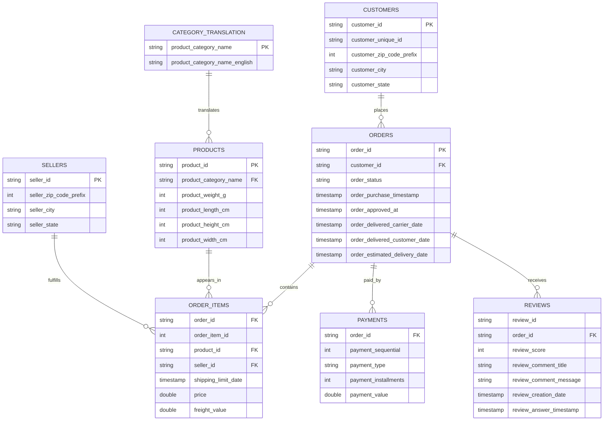
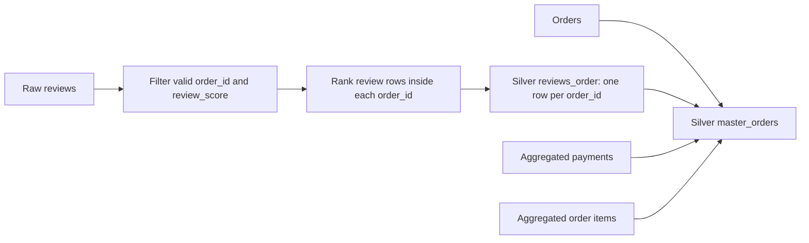
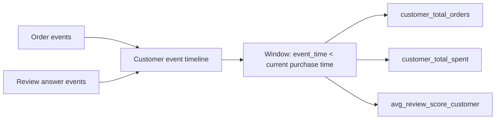

# Olist E-commerce ERD

ERD ben duoi mo ta cac bang raw va quan he chinh duoc dung trong ETL.

## Grain Cua Silver Layer

`reviews` khong the join truc tiep vao `orders`: mot `order_id` co the co nhieu
review record. Notebook ETL xep hang review theo `review_answer_timestamp`,
`review_creation_date`, `review_id` va giu review moi nhat:

## Gold Feature Layer

Feature lich su customer chi su dung su kien co timestamp nho hon
`order_purchase_timestamp` cua order hien tai:

